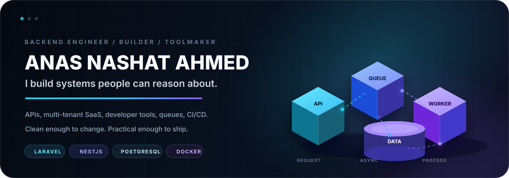

 

 

## `01` / Build

I’m a backend-focused engineer who likes turning **complex requirements into systems that stay understandable as they grow**. My work sits between backend architecture, developer experience, automation, and shipping real products.

`Laravel` · `NestJS` · `Node.js` · `Django` · `PostgreSQL` · `Redis` · `Docker` · `GitHub Actions`

 

## `02` / Selected work

<table>
<tr>
<td width="34%" valign="top">

### Laravel Easy Dev

**Open-source developer tooling**

Generate APIs, architecture layers, tests, DTOs, OpenAPI docs, and AI-ready project context for Laravel projects.

[GitHub ↗](https://github.com/anasnashat/laravel-easy-dev) · [Packagist ↗](https://packagist.org/packages/anas/easy-dev)

</td>
<td width="33%" valign="top">

### Easy Dev Studio

**Context-aware VS Code tooling**

Project-aware generation for Laravel, NestJS, Django, Express, and Node.js with customizable templates.

[GitHub ↗](https://github.com/anasnashat/easy-dev-studio) · [Marketplace ↗](https://marketplace.visualstudio.com/items?itemName=AnasNashaatAhmed.easy-dev-studio)

</td>
<td width="33%" valign="top">

### Anvora

**Multi-tenant automation platform**

NestJS + PostgreSQL + Redis + BullMQ + Prisma + Socket.IO + Docker, with a Next.js dashboard.

[GitHub ↗](https://github.com/anasnashat/anvora)

</td>
</tr>
</table>

 

## `03` / Engineering DNA

<table>
<tr>
<td width="33%" align="center">

**ARCHITECTURE**

Make the system easy to reason about.

</td>
<td width="33%" align="center">

**AUTOMATION**

Remove repetitive work when it can become a tool.

</td>
<td width="33%" align="center">

**DELIVERY**

A clean design still has to survive real deployment.

</td>
</tr>
</table>

 

### Build useful things. Keep the architecture understandable.

I learn by building, breaking assumptions, debugging the failure, and improving the design.

 

[LinkedIn](https://linkedin.com/in/anasnashat) · [Portfolio](https://anasnashat.github.io/my-portfolio/) · [GitHub](https://github.com/anasnashat) · [Email](mailto:anas.nashat.ahmed@gmail.com)

